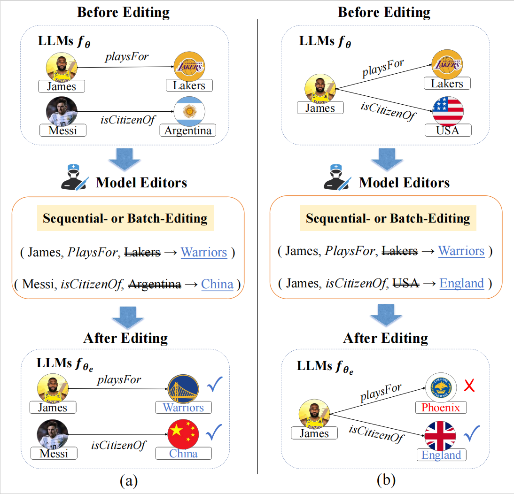

# Related Knowledge Perturbation Matters

This repository includes the data and python implementation for the paper "Related Knowledge Perturbation Matters: Rethinking Multiple Pieces of Knowledge Editing in Same-Subject." (Accepted by NAACL 2025 Main Conference).

    

## DataSet
Our dataset is located in `S2RKE.json`. Compared to the dataset COUTERFACT, the knowledge density surrounding the same topic is higher.

| Item | S2RKE| COUNTERFACT |
|------|---------|---------|
| Records | 22064 | 21919 |
| Subjects | 4503 | 20391 |
| Relations | 43 | 32 |
| Maximum records per subject | 13 | 4 |
| Minimum records per subject | 3 | 1 |
| Average records per subject | 4.9 | 1.1 |
## Model Preparation
