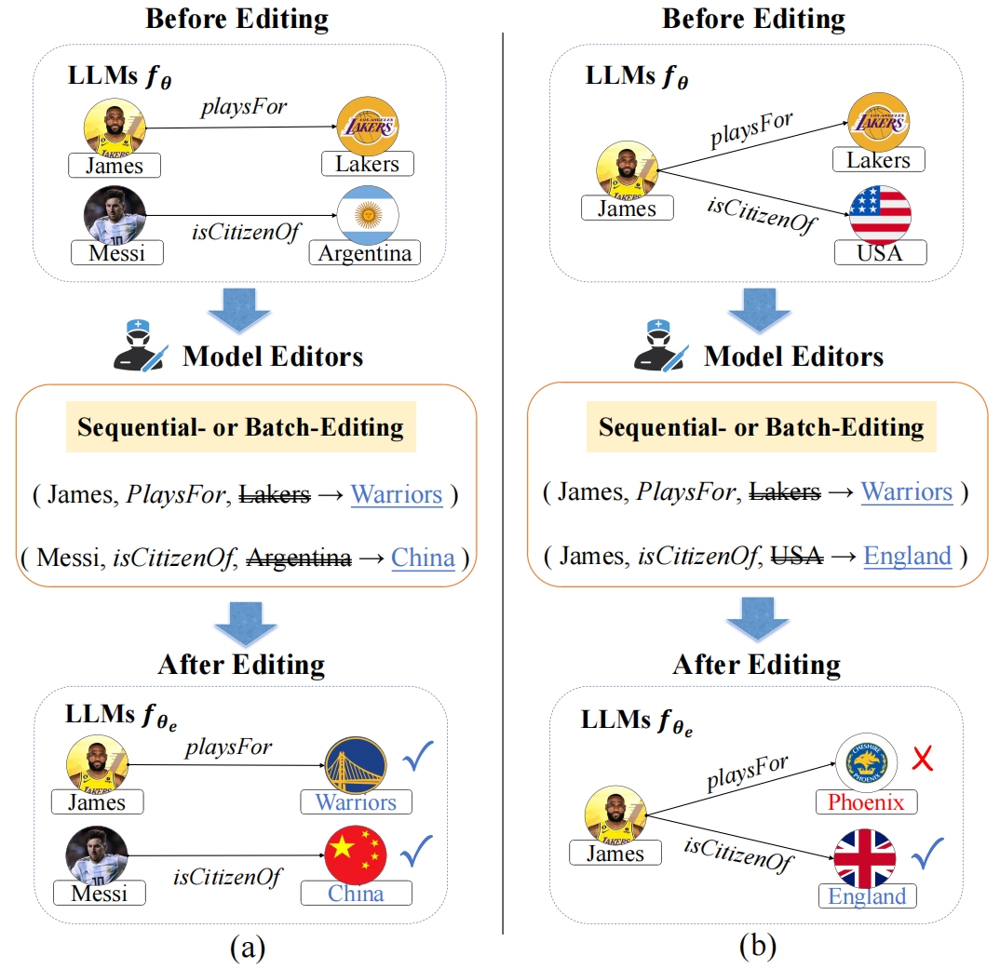

# Related Knowledge Perturbation Matters: Rethinking Multiple Pieces of Knowledge Editing in Same-Subject
This repository includes the data and python implementation for the paper "Related Knowledge Perturbation Matters: Rethinking Multiple Pieces of Knowledge Editing in Same-Subject." (Accepted by NAACL 2025 Main Conference).

